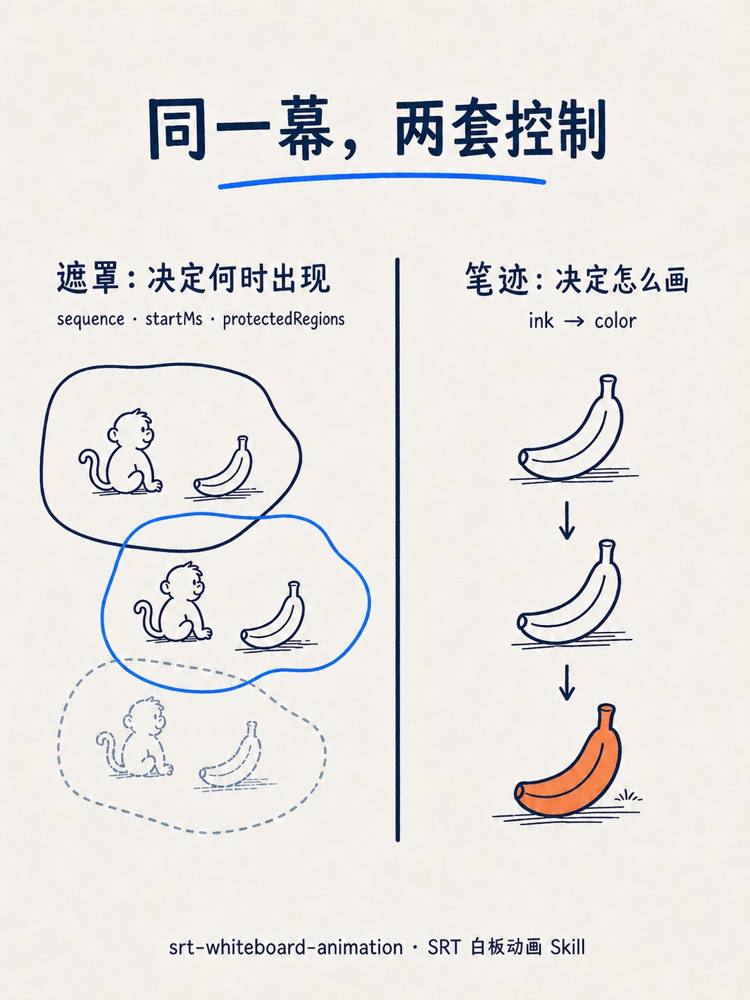

<div align="center">

# Social Content Kit

**把来源变成可直接发布的社交文案和可进入视觉生产的配图规格。**

[English](README.md) · [案例](#showcase) · [安装](#安装) · [常见问题](#常见问题)

</div>

**Social Content Kit** 是一个 [Agent Skill](https://github.com/KKenny0/social-content-kit-skill)，面向「来源 → 社交媒体内容套件」的编辑流程。输入 **URL**、**文件** 或 **知识点**，默认输出彼此一致的平台发布文案和自包含配图制作单；明确要求文章时才增加 `article-draft`，长文、短文或极短文只决定篇幅。

| | |
| --- | --- |
| **类别** | Agent Skill · 社交媒体编辑流水线 |
| **输入** | URL、本地文件或知识点文本 |
| **默认输出** | `publish-info` · `figure-spec` |
| **按需文章产物** | `article-draft` |
| **视觉身份** | Folio Editorial Sketch · 唯一固定 House Style |
| **安装** | `npx skills add https://github.com/KKenny0/social-content-kit-skill` |
| **协议** | MIT |

## 为什么需要 Social Content Kit

难的通常不是找到信息，而是把零散来源变成社交内容，同时不让文案和视觉彼此漂移：

- 发布正文省略了让推荐可信的限制；
- 每张卡片重复信息，没有唯一认知任务；
- 图片提示词看起来精致，却加入了来源未支持的主张。

Social Content Kit 把它们当作同一个编辑问题：先建立内部的经核查内容核心，再从同一个事实边界派生发布文案和视觉规格。文章不再是强制中间产物，只在明确请求时生成。

## 你会得到什么

| 层次 | 对应内容 | 作用 |
| --- | --- | --- |
| 证据 | 内部经核查内容核心 | 记录来源、主张、精确值、限制与不确定性；不会作为额外产物输出。 |
| 发布 | `publish-info` | 面向平台的标题、发布正文、来源说明和标签。 |
| 视觉方向 | `figure-spec` | 每张图一份自包含的制作单：图上文案、构图、视觉机制与事实限制。 |
| 按需文章 | `article-draft` | 一篇脱离图片也能独立发布的文章；篇幅服从用户要求。 |

默认社交媒体套件按以下顺序交付：

1. `publish-info`
2. `figure-spec`

明确要求「完整内容套件」「文章与配图」或「公众号长文套件」时，交付：

1. `publish-info`
2. `article-draft`
3. `figure-spec`

使用「只要 / 不要 / 无需 / 仅输出」等明确限定时，严格按限定交付。

**Social Content Kit 不负责**：生成最终图片、自动发布，或编排动态/视频资产。每份 `figure-spec` 都是自包含的：把其中的完整生图指令贴进 Codex 的 `imagegen`、ChatGPT 配图能力或其他生图工具即可。

## 什么时候用 Social Content Kit

| 适合用 Social Content Kit | 不必用 Social Content Kit |
| --- | --- |
| 要做社媒多图轮播或图片卡片，并需要可直接发布的正文 | 只要摘要、学习笔记或普通单篇文章 |
| 要把项目或工具整理成面向采用决策的推荐 | 需要最终成图或自动发帖 |
| 明确需要文章与事实一致的配图规格 | 需要未支持的视觉风格或动态媒体 |

常见输入：开源仓库 URL、技术帖、研究笔记、产品页，或直接粘贴的知识点。

## Showcase

以下套图基于真实的 [srt-whiteboard-animation](https://github.com/geeklee/srt-whiteboard-animation) 仓库验证。四张卡片承担不同阅读任务，但不切换视觉身份。

<table width="100%">
  <tr>
    <th colspan="4" align="center"><a href="https://github.com/geeklee/srt-whiteboard-animation">srt-whiteboard-animation ↗</a></th>
  </tr>
  <tr>
    <td width="25%" align="center" valign="top"><a href="assets/showcase/srt-whiteboard-01.jpg"></a></td>
    <td width="25%" align="center" valign="top"><a href="assets/showcase/srt-whiteboard-02.jpg"></a></td>
    <td width="25%" align="center" valign="top"><a href="assets/showcase/srt-whiteboard-03.jpg"></a></td>
    <td width="25%" align="center" valign="top"><a href="assets/showcase/srt-whiteboard-04.jpg"></a></td>
  </tr>
  <tr>
    <td width="25%" valign="top"><strong>入口</strong><br />来源与价值</td>
    <td width="25%" valign="top"><strong>流程</strong><br />精确时间与分组</td>
    <td width="25%" valign="top"><strong>机制</strong><br />两套控制各自负责什么</td>
    <td width="25%" valign="top"><strong>判断</strong><br />适用对象与下一步<br /><a href="examples/srt-whiteboard-animation.md">查看 publish-info + figure-spec</a></td>
  </tr>
</table>

## 如何保持一致性

Social Content Kit 有统一的 taste，但不是固定模板。

- **事实边界**：避免发布正文与视觉规格夸大或改写来源。
- **编辑结构**：每张图只承担一个认知任务，而不是试图在一张卡里塞进全部信息。
- **白话优先**：标题、职责标签和主关系先让读者看懂结论，字段与参数只作就地证据。
- **唯一 House Style**：跨帖固定暖灰白纸面、深蓝墨线、钴蓝结构、陶土橙强调、字体和手绘语法。
- **视觉机制路由**：根据每张图要解释的关系改变手绘机制、语义纸片、构图和强调色面积，而不是切换风格。
- **Figure Spec QA**：在交付前检查可读性、层级、安全区、图文碰撞与事实限制。

这让系列内容有连续的作者感，同时仍然服从来源、受众和发布场景。

## 安装

```bash
npx skills add https://github.com/KKenny0/social-content-kit-skill
```

适用于支持 Skills 格式的 Agent 运行时，例如 Claude Code 或兼容 `skills add` 的宿主。

## 使用

```text
$social-content-kit https://github.com/owner/repo
```

这个默认调用会生成 `publish-info` 和 `figure-spec`。其他常见写法：

```text
$social-content-kit ./notes/meeting.md
$social-content-kit "长上下文里的 prefix cache"
$social-content-kit https://example.com/post -- 平台: 公众号 语言: 中文 图数: 4
$social-content-kit https://example.com/post -- 完整内容套件，包含文章和 4 张配图规格
```

可选：发布平台、语言、画幅、图数和所需产物。视觉 Style 不再是可选项。

用户和发布平台都未指定画幅时，默认使用 `3:4` 竖版画布（`1536×2048 px`）。

只需摘要或普通单篇文章时，直接向 Agent 提要求即可，不必调用 Social Content Kit。

## 常见问题

**Social Content Kit 是什么？**

一个 Agent Skill：把 URL、文件或知识点整理成可直接发布的平台文案和逐图自包含的视觉制作规格。

**这个 Skill 以前叫 Folio 吗？**

是。从 v0.9.0 开始，公开 Skill ID 改为 `$social-content-kit`，仓库改为 `social-content-kit-skill`。请重新安装 Skill 以更新调用名；固定视觉身份仍叫 Folio Editorial Sketch。

**默认会生成什么？**

`publish-info`（标题、发布正文、来源说明、标签）和 `figure-spec`（每张卡片一份自包含视觉规格）。

**还可以生成可独立发布的文章吗？**

可以。在显式 `$social-content-kit` 请求中只要求一篇独立文章时，只返回 `article-draft`。需要三个产物时，请明确要求文章与配图、完整内容套件或公众号长文套件。

**没有可见文章时，怎样保证事实一致？**

Social Content Kit 会先在内部建立经核查内容核心，记录来源、主张、精确值、限制和不确定性，再从中派生所有用户产物。

**Social Content Kit 会生成图片吗？**

不会。它交付可直接进入视觉生产的 `figure-spec`。最终图片由 Codex `imagegen`、ChatGPT 配图或其他生图工具生成。

**使用什么视觉风格？**

只使用 Folio Editorial Sketch：以编辑层级和手绘关系为主体，纸片只在解释边界或转化时介入，半调保持局部。固定视觉身份是为了让不同来源的社交帖子仍然像同一个账号。

**在哪里看完整默认套件？**

见 [examples/srt-whiteboard-animation.md](examples/srt-whiteboard-animation.md)。

## 协议

MIT
